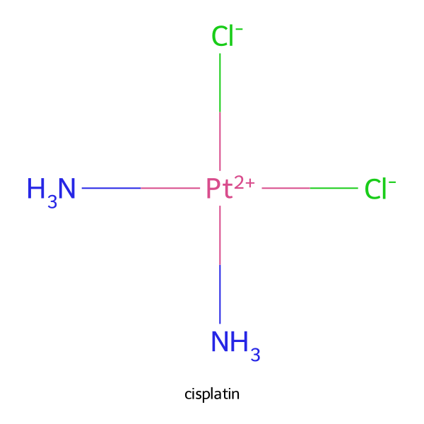
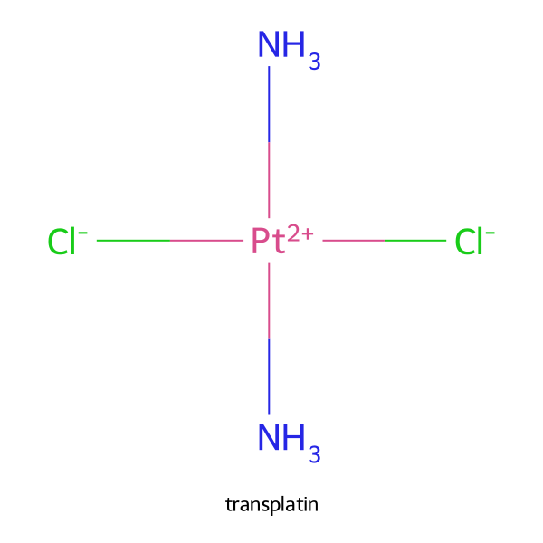
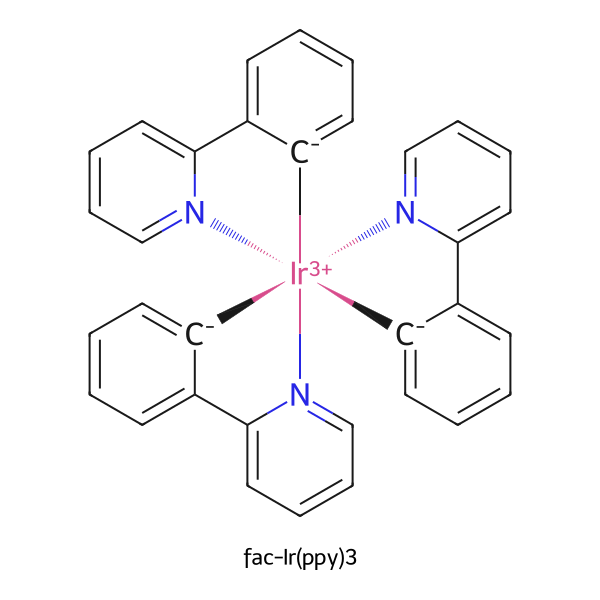
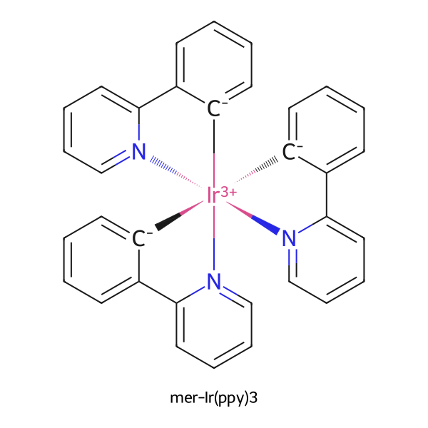

# metal2d

Readable 2D depictions of coordination and organometallic complexes for RDKit.

RDKit's coordinate generators are built for organic molecules. They have no
notion of a coordination sphere, no idea that six dative bonds to one atom
should fan out, and no idea that five bonds to the same ring mean one
η-interaction. Complexes come out as a knot around the metal.

`metal2d` does not replace the depiction engine. It cuts the ligands off, lets
CoordGen draw each of them on its own — which it does well, they are ordinary
organic fragments — and then arranges them around the metal itself. Dedicated
paths handle metal-metal cores, bridging ligands, macrocyclic cavities and
eta-bound rings. Input can be ordinary coordination SMILES or a monometallic
T-REX-Full string carrying explicit coordination topology.

---


## Examples

Each figure shows the same molecule from the two RDKit generators and from
`metal2d`, with the readability metrics printed above each panel.

**Tris(dichloro-dipyridophenazine)ruthenium(II)** — three large fused ligands on
one centre.


```
Clc1cc2nc3c4ccc[n]5->[Ru+2]67(<-[n]8cccc(c3nc2cc1Cl)c8c45)(<-[n]1cccc2c3nc4cc(Cl)c(Cl)cc4nc3c3ccc[n]->6c3c21)<-[n]1cccc2c3nc4cc(Cl)c(Cl)cc4nc3c3ccc[n]->7c3c21
```

**Ruthenium bis(dppm) methylimidazole-thiolate** — two bidentate phosphines with
eight phenyl rings between them.


```
Cn1cc[n]2->[Ru+2]34(<-[S-]c12)(<-[P](C[P]->3(c1ccccc1)c1ccccc1)(c1ccccc1)c1ccccc1)<-[P](C[P]->4(c1ccccc1)c1ccccc1)(c1ccccc1)c1ccccc1
```

**Cp\*-iridium(III) iminopyridine chloride** — an η⁵ ring, drawn as a single bond
to the ring centre rather than five bonds to five carbons.


```
CC(C)c1cccc(C(C)C)c1/[N]1=C/c2ccc3cc(F)ccc3[n]2->[Ir+3]<-12345(<-[Cl-])<-[c]1(C)[c]->2(C)[c]->3(C)[c-]->4(-c2ccc(-c3ccccc3)cc2)[c]->51C
```

---


## Install

```bash
pip install metal2d
```

Only RDKit and numpy are required. `pip install metal2d[png]` adds cairosvg for
PNG output, `metal2d[progress]` adds a nicer progress bar.

## Use

```python
from rdkit import Chem
import metal2d

mol = Chem.MolFromSmiles("[Cl-]->[Pt+2]12<-[S-]C(=N[N]->1=Cc1cccc[n]->21)Nc1ccccc1")

coords = metal2d.depict(mol)          # a copy carrying a 2D conformer
metal2d.draw(coords, "complex.svg")   # or .png
```

`depict()` only produces coordinates, so the result can go to any renderer, into
`MolsToGridImage`, or out to a molfile. `draw()` is the convenience wrapper.

From the command line, on a SMILES or T-REX string, a `.smi`/`.csv` list, an
SDF, or a `.trex` file:

```bash
metal2d draw "CC(C)(C)c1cc[n]2->[Ru+2]34..."
metal2d draw complexes.smi --png --outdir figures
metal2d draw library.sdf --index 0 5 12
metal2d draw complexes.trex --outdir figures
```

Input format does not matter: incoming coordinates are discarded and
regenerated. What is required is that the metal–donor bonds are present in the
connection table, as dative bonds (`->`, `<-`) or plain ones. Complexes written
as separated ions (`[Ru+2].c1ccncc1...`) carry no coordination information and
fall through to plain CoordGen.

### T-REX input

[T-REX](https://github.com/KevlishviliGroup/trex) records the coordination
geometry and trans-pair map separately from ligand connectivity. This preserves
cis/trans, fac/mer and related topological information that can be lost when a
complex is reduced to ordinary SMILES.

```python
import metal2d

cisplatin = (
    "Pt{+2} | L=[ SMILES:[Cl-], SMILES:[Cl-], SMILES:N, SMILES:N ] "
    "| MAP:{ (1:1, 3:1), (2:1, 4:1) } | G:sqpl"
)

mol = metal2d.depict_trex(cisplatin)
metal2d.draw(mol, "cisplatin.svg")

# Unified entry point when the caller may receive either format:
mol = metal2d.depict_input(cisplatin)
```

The complete, reproducible examples for cisplatin, transplatin and the
fac/mer pair of octahedral `Ir(ppy)3` are in
[`examples/trex_examples.py`](examples/trex_examples.py). Running the script
regenerates the corresponding SVG files in `images/`:

| cisplatin | transplatin |
| --- | --- |
|  |  |

| `fac-Ir(ppy)3` | `mer-Ir(ppy)3` |
| --- | --- |
|  |  |

`Ir(bpy)3` itself has `Δ/Λ` optical isomers rather than fac/mer isomers,
because the two donor atoms within each bpy ligand are equivalent.

The public T-REX API consists of `parse_trex`, `mol_from_trex`,
`classify_topology`, `depict_trex`, `draw_trex`, `mol_from_input`, and
`depict_input`. Only monometallic T-REX-Full records with `SMILES:` ligand
payloads are converted in this release; unsupported payload types fail
explicitly rather than silently discarding topology. T-REX input is not a CIF
or general 3D-file reader.

---


## Benchmarks

Measured on every tenth structure of **[tmQM](https://github.com/uiocompcat/tmQM/blob/master/tmQM/tmQM_y.csv)** — 10,083 mononuclear transition-metal complexes drawn from the Cambridge Structural Database. A public dataset, and one the algorithm was never tuned on:


|                       | bond crossings | atom overlaps | donors facing away | clean drawings |
| --------------------- | -------------- | ------------- | ------------------ | -------------- |
| RDKit Compute2DCoords | 4.43           | 2.57          | 54.5%              | 28.8%          |
| RDKit CoordGen        | 3.93           | 0.51          | 55.1%              | 49.1%          |
| **metal2d v0.3.0**    | **0.62**       | **0.04**      | **25.1%**          | **72.5%**      |


```bash
metal2d metrics tmqm.csv --step 10
```

A 300-structure subset ships with the package, so the numbers can be checked
without downloading anything:

```bash
metal2d metrics "$(python -c 'import metal2d,os;print(os.path.join(os.path.dirname(metal2d.__file__),"data","sample.smi"))')"
```

It is stratified across 23 metals and deliberately weighted towards the awkward
cases — 14% of it carries η-bonded groups, coordination numbers run from 1 to 13
and denticities from 1 to 8 — so it scores harsher than tmQM:


| on the bundled sample | bond crossings | atom overlaps | clean drawings |
| --------------------- | -------------- | ------------- | -------------- |
| RDKit CoordGen        | 5.51           | 0.52          | 44.0%          |
| **metal2d v0.3.0**    | **0.63**       | **0.01**      | **77.0%**      |


`examples/make_sample.py` regenerates it from a database CSV, deterministically.

## What it actually does

1. Cut every bond from the metal, giving one fragment per ligand.
2. Depict each fragment on its own with CoordGen.
3. Collapse η-bonded groups — Cp, Cp\*, arenes, allyl — into a single
   pseudo-donor at the ring centroid.
4. Fold each chelate into a conformation that can actually chelate. A free
  2,2'-bipyridine is drawn *s-trans*, with its nitrogens pointing apart, which
   no metal position can satisfy. In two dimensions, rotating about a bond is a
   reflection, so the fix is to search reflections for the one that puts the
   donors on a small circle.
5. Place the metal. For three or more donors it goes at the centre of the circle
   through them, the only point equidistant from all of them. For one or two,
   on an arc of slots.
6. Share the 360° around the metal in proportion to how wide each ligand really
   is, then relax rotations to clear the remaining collisions.
7. For polynuclear structures, detect metal-metal, shared-atom and whole-ligand
   bridges, construct the shared core first, and place terminal halves around
   it. Equivalent halves may be mirrored as complete rigid units instead of
   being laid out independently.


## Known limitations

- **Over-long metal–donor bonds.** When several bulky ligands compete for room,
they get pushed outward and the bonds to the metal are drawn visibly longer
than an ordinary bond — noticeably more so than with CoordGen. This is the main
remaining defect.
- **Bulky monodentate donors.** A triarylphosphine puts three rings on one atom
1.5 bond lengths from the centre; it will subtend more than 120° no matter how
the ligands are shared out. Bidentate phosphines are fine.
- **Large wrapping ligands.** Peptide conjugates and macrocyclic chelators that
envelop the metal are handled better by plain CoordGen, which has dedicated
macrocycle support. This is where most of the remaining losses sit.
- **Large polynuclear cores.** Dinuclear structures have dedicated paths for
metal-metal bonds, shared donor atoms, whole-ligand bridges and equivalent
terminal halves. Cores of three or more metals still rely partly on recursive
layout and may need manual coordinates when several rigid bridges compete.
- Cage ligands such as PTA or adamantane cannot be drawn flat without
self-crossings at all. `metal2d metrics` reports how many crossings lie inside
a single ligand, so this can be told apart from a bad arrangement.


## A note on measuring depictions

Counting bond crossings naively penalises correct organometallic drawing. The
bond from a metal to the centre of an η-bonded ring **must** cross that ring's
perimeter to get there, so every η group adds one unavoidable crossing, which
on a haptic-rich set is enough to swing the clean-drawing rate substantially.
`metal2d metrics` recognises the centroid bond and forgives that single crossing —
and only that one: a haptic bond crossing anything else still counts.
